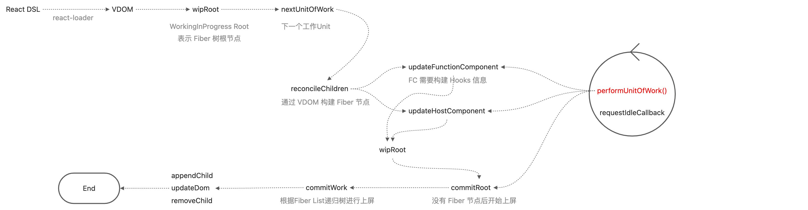
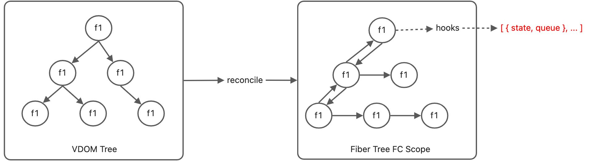

> 徒手写一个基于 Fiber 和 Hooks 的 React Likely Framework

## 简介
完成了基础 Fiber、Hooks 的功能，目的只是为了学习 React 相关知识，从底层开始了解 React 的运行机制

## 主流程

### 渲染主流程
 fiber 架构就分为了 schdule、reconcile（vdom 转 fiber）、commit（更新到 dom）三个阶段，vdom 转 fiber 的过程叫做 reconcile，最后增删改真实 dom 的过程叫做 commit。


### Hooks 实现
VDOM 到 Fiber 的过程，Hooks 状态保存到 FC Fiber 节点，hooks 状态存放在 FC 的 FiberRoot 节点上。


### useState
```javascript
/**
 * 1. 为当前 hook 设置索引位置，新增or使用上一次 hook state
 * 2. 回调执行后更新 fiber 数，让 schdule 更新数
 * @param {any} initialState 
 * @returns 
 */
const useState = (initialState) => {
  const oldHook =
    wipFiber.alternate &&
    wipFiber.alternate.hooks &&
    wipFiber.alternate.hooks[hookIndex];
  const hook = {
    state: oldHook ? oldHook.state : initialState,
    queue: []
  };

  const actions = oldHook ? oldHook.queue : [];
  actions.forEach((action) => {
    hook.state = action(hook.state);
  });

  const setState = (actionCallback) => {
    const action = typeof actionCallback !== 'function' ? () => actionCallback : actionCallback;

    hook.queue.push(action);
    wipRoot = {
      dom: currentRoot.dom,
      props: currentRoot.props,
      alternate: currentRoot
    };
    nextUnitOfWork = wipRoot;
    deletions = [];
  };

  wipFiber.hooks.push(hook);
  hookIndex++;
  return [hook.state, setState];
};
```

### useRef

把数据保存在 hook 上，上屏操作时把 DOM 指向 fiber.props.ref.current 上
```javascript
const useRef = (initialValue) => {
  const oldHook = wipFiber?.alternate?.hooks?.[hookIndex];
  const ref = { current: initialValue };
  const hook = {
    state: oldHook?.state || ref
  };

  wipFiber.hooks.push(hook);
  hookIndex ++;
  return ref;
};

const updateHostComponent = (fiber) => {
  if (!fiber.dom) {
    fiber.dom = createDOM(fiber);
    
    if (fiber?.props?.ref) {
      fiber.props.ref.current = fiber.dom;
    }
  }

  reconcileChildren(fiber, fiber.props.children);
};
```

### useEffect

两个参数，第一个是回调，第二是监听的数据

// TODO
